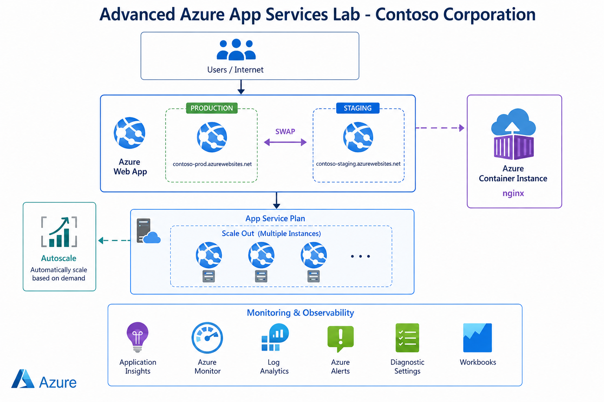

# Step-by-Step Guide - Advanced Azure App Services Lab

**App Service Plan + Web App + Deployment Slots + Scaling + Container Instance**

## 🎯 Scenario
**Contoso Corporation** is launching a new customer portal web application. They require high availability, zero-downtime deployments, separate environments, and scaling capabilities.

## 🏗️ Architecture

---

### STEP 1 — Create Resource Group
1. Search **Resource groups** → **+ Create**
2. Name: `rg-appservice-advanced`
3. Region: **UAE North**
4. Click **Review + create** → **Create**

### STEP 2 — Create App Service Plan
1. Search **App Service Plans** → **+ Create**
2. Name: `asp-production`
3. OS: **Windows**
4. Pricing Tier: **S1** (recommended)
5. Click **Review + create** → **Create**

### STEP 3 — Create Web App
1. Search **Web Apps** → **+ Create**
2. Name: `webapp-ruba-demoo` (globally unique)
3. Publish: **Code**
4. Runtime stack: **.NET 8** or **Node.js**
5. App Service Plan: `asp-production`
6. Click **Review + create** → **Create**

### STEP 4 — Test Web App
Open: `https://webapp-ruba-demo.azurewebsites.net`

---

### STEP 5 — Create Deployment Slot (Staging)
1. Open Web App → **Deployment slots**
2. Click **+ Add Slot**
3. Name: `staging`
4. Click **Create**

### STEP 6 — Deploy Different Content to Slots
- **Production Slot**: Show "Production Environment"
- **Staging Slot**: Show "Staging Environment"

Use Kudu (Advanced Tools) or Visual Studio to edit `index.html` in each slot.

### STEP 7 — Test Both Slots
- Production: `https://webapp-ruba-demoo.azurewebsites.net`
- Staging: `https://webapp-ruba-demoo-staging.azurewebsites.net`

### STEP 8 — Perform Zero-Downtime Slot Swap
1. Go to **Deployment slots**
2. Click **Swap**
3. Source: `staging`
4. Target: `production`
5. Click **Swap**

---

### STEP 9 — Configure Scale Out (Manual)
1. Go to App Service Plan → **Scale out**
2. Set **Instance count** = `2` or `3`
3. Click **Save**

### STEP 10 — Configure Autoscale
1. In App Service Plan → **Scale out** → **Custom autoscale**
2. Add rules:
   - CPU > 70% → Add 1 instance
   - CPU < 30% → Remove 1 instance
3. Set Min=1, Max=5
4. Save

### STEP 11 — Create Azure Container Instance
1. Search **Container Instances** → **+ Create**
2. Name: `container-demo`
3. Image: `mcr.microsoft.com/oss/nginx/nginx:1.9.15-alpine (Linux)`
4. Port: 80
5. Create

### STEP 12 — Test Container Instance
Open: `http://<ACI-Public-IP>`

---

**Lab Completed Successfully!** 🎉
